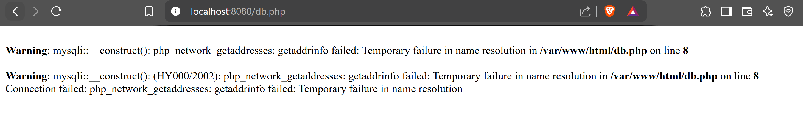
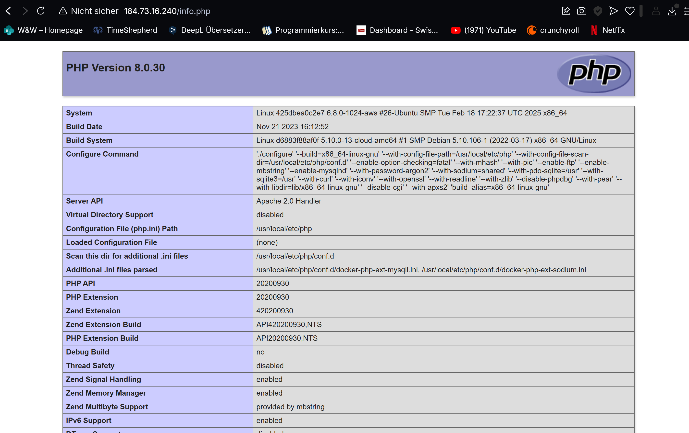

# KN04

## Docker Compose - Befehle von `docker compose up`

Der Befehl `docker compose up` führt eine Reihe von Befehlen aus, um Container zu starten und die Umgebung entsprechend der `docker-compose.yml`-Datei zu konfigurieren.

## Ablauf von `docker compose up`

### 1. Netzwerke erstellen
```sh
 docker network create
```
Erstellt das definierte Netzwerk mit den angegebenen Parametern.

### 2. Images bauen (falls notwendig)
```sh
 docker build
```
Baut Images basierend auf den Anweisungen im `Dockerfile`.

### 3. Container erstellen
```sh
 docker create
```
Erstellt Container basierend auf den Images.

### 4. Container starten
```sh
 docker start
```
Startet die erstellten Container.

### 5. Abhängigkeiten prüfen
Stellt sicher, dass Container in der richtigen Reihenfolge gestartet werden, basierend auf `depends_on` in der `docker-compose.yml`.

### 6. Volumes erstellen (falls definiert)
Erstellt persistente Datenspeicher, falls Volumes in der `docker-compose.yml` angegeben sind.

### 7. Logs streamen
```sh
 docker logs -f <container_name>
```
Zeigt die Logs aller Container an (wenn `docker compose up` ohne `-d` verwendet wird).

---
Mit diesen Schritten sorgt `docker compose up` für eine funktionierende Container-Umgebung entsprechend der definierten Konfiguration.


---

## Warum der Fehler auftritt
Wenn Sie die Seite `db.php` aufrufen, wird ein Fehler auftreten, weil:

1. **Die Datenbankverbindung schlägt fehl**: In Ihrer `db.php` ist der Datenbankserver als `kn02b-db` definiert, aber in der Docker Compose Datei hat er nun den Namen `m347-kn04b-db`.
   - **Ursache**: Die PHP-Dateien wurden bereits während des Image-Builds in das Image `levinwiederkehr/kn02b-web` eingebettet. Diese eingebetteten Dateien verwenden den alten Hostnamen `kn02b-db` für die Datenbankverbindung, aber im neuen Setup heißt der Datenbankcontainer `m347-kn04b-db`.
2. **Netzwerkproblem**: Die Container befinden sich zwar im selben Docker-Netzwerk, aber die Anwendung versucht, einen Container mit einem anderen Namen zu erreichen.

## Lösungsmöglichkeiten
Es gibt verschiedene Lösungen für dieses Problem:

### 1. Volume-Mapping
Sie könnten die lokalen PHP-Dateien mit aktualisiertem Hostnamen über ein Volume in den Container einbinden:

```yaml
web:
  # ... andere Konfigurationen
  volumes:
    - ./neue-db.php:/var/www/html/db.php
```

### 2. Container-Alias
Sie könnten den Datenbank-Container mit einem Alias für den alten Namen versehen:

```yaml
db:
  # ... andere Konfigurationen
  networks:
    kn04b-network:
      aliases:
        - kn02b-db
```

### 3. Neues Image bauen
Die sauberste Lösung wäre, ein neues Image mit aktualisierten PHP-Dateien zu bauen.

### 4. DNS-Eintrag
Sie könnten auch einen `extra_hosts`-Eintrag im Web-Container hinzufügen:

```yaml
web:
  # ... andere Konfigurationen
  extra_hosts:
    - "kn02b-db:172.20.5.3"
```

### **Empfohlene Lösung**
Die einfachste Lösung ist **Option 2 mit dem Netzwerk-Alias**, da diese keine Änderung der PHP-Dateien erfordert.





