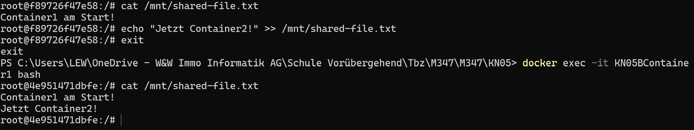
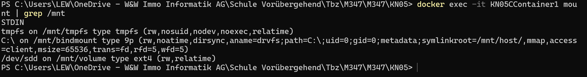
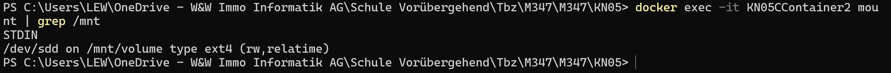

# KN05

## A) Bind Mounts
Teilt einen Speicherbereich zwischen dem Host und dem Container.
```sh
docker run -dit --name bindmount-container-KN05 -v C:\M347KN05:/mnt nginx bash
```
Betritt den Container:
```sh
docker exec -it bindmount-container-KN05 bash
```
Setzt die Berechtigungen für das Skript:
```sh
chmod +x /mnt/script.sh
```
Führt das Skript aus:
```sh
bash script.sh
```


## B) Volumes
Erstellt ein benanntes Volume:
```sh
docker volume create KN05BVolume
```
Startet zwei Container mit dem gleichen Volume:
```sh
docker run -dit --name KN05BContainer1 -v KN05BVolume:/mnt nginx bash
```
```sh
docker run -dit --name KN05BContainer2 -v KN05BVolume:/mnt nginx bash
```
Schreibt in eine Datei von Container1:
```sh
docker exec -it KN05BContainer1 bash
```
```sh
echo "Container1 am Start!" >> /mnt/shared-file.txt
```
Liest die Datei in Container2 und schreibt eine neue Zeile:
```sh
docker exec -it KN05BContainer2 bash
```
```sh
cat /mnt/shared-file.txt
```
```sh
echo "Jetzt Container2!" >> /mnt/shared-file.txt
```



## C) Speicher mit Docker-Compose


