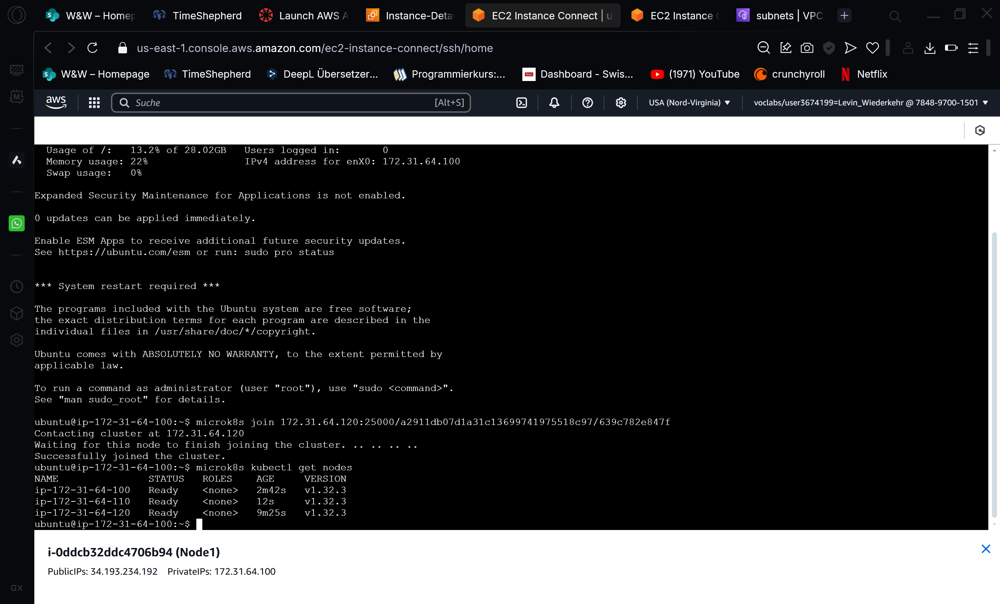
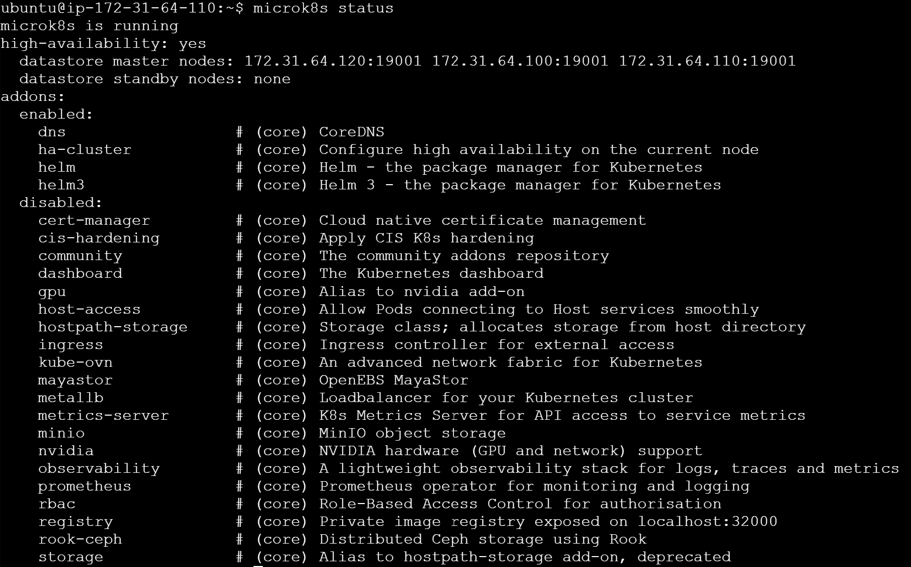
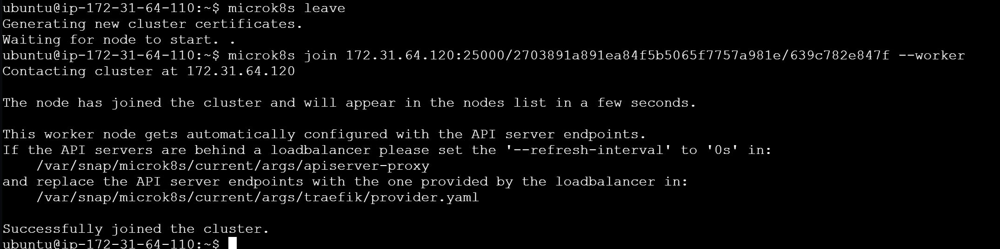
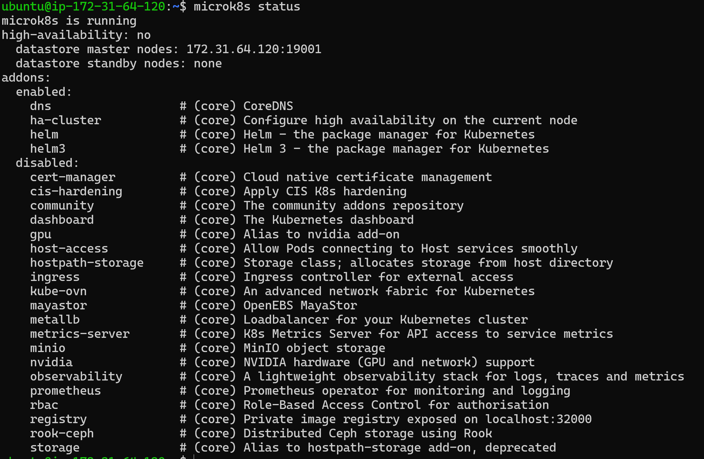
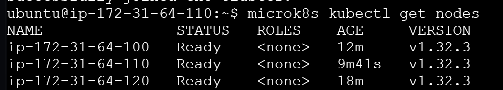

# KN06

## Unterschied zwischen microk8s und microk8s kubectl:

### microk8s: 
Haupt-Tool zur Verwaltung der MicroK8s-Installation, z. B. für Start, Stopp, Status oder das Hinzufügen/Entfernen von Nodes.

### microk8s kubectl: 
Eingebettete Version von kubectl in MicroK8s zur Verwaltung von Kubernetes-Ressourcen wie Pods, Services und Deployments.

---

