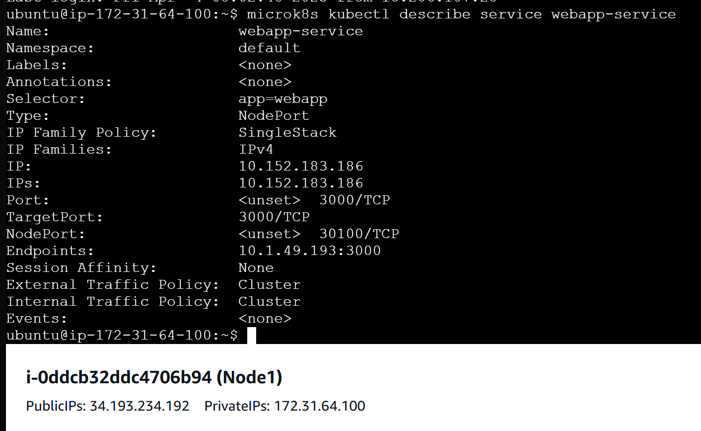
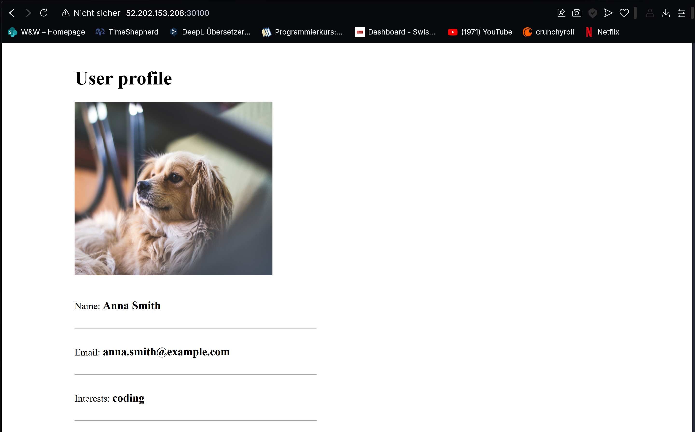
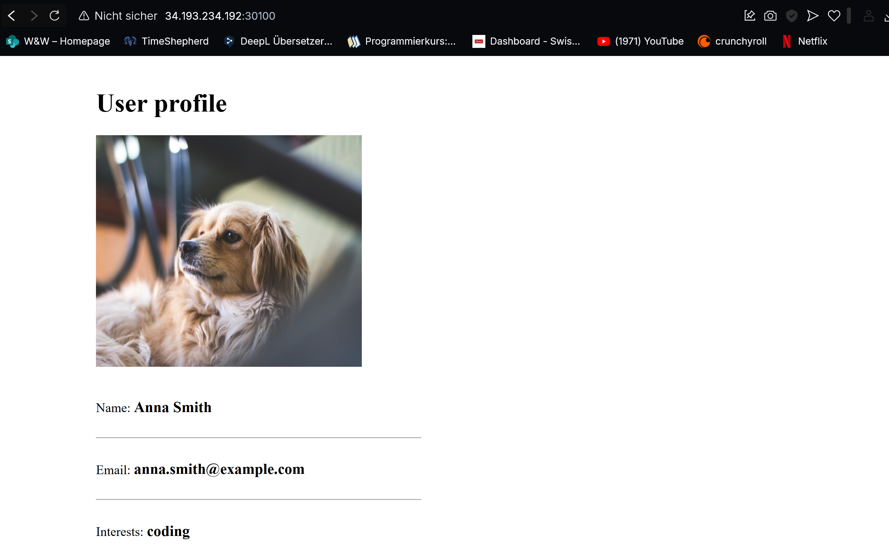
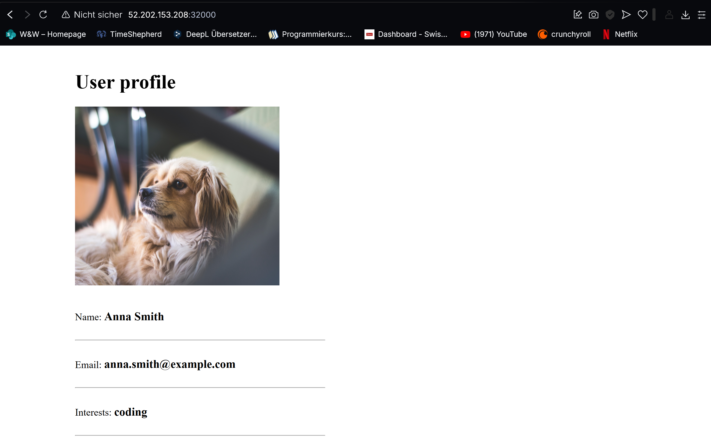
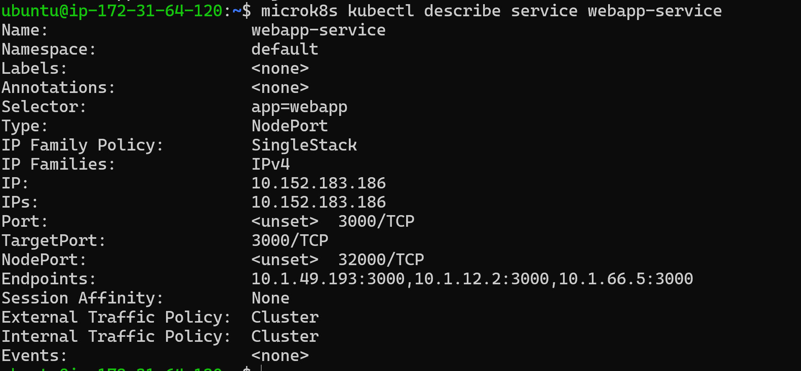

# KN07
## A)

### Unterschied zwischen Pods und Replicas

#### Pods: 
Die kleinste Einheit in Kubernetes, eine einzelne Instanz einer Anwendung mit einem oder mehreren Containern, die zusammen arbeiten.
#### Replicas: 
Identische Kopien eines Pods, verwaltet durch den ReplicaSet-Controller, um Verfügbarkeit und Lastverteilung zu gewährleisten.

### Unterschied zwischen Service und Deployment

#### Deployment: 
Definiert den gewünschten Zustand einer Anwendung (Image, Replicas, Update-Strategie) und verwaltet deren Lebenszyklus.
#### Service: 
Bietet einen stabilen Netzwerkendpunkt (IP-Adresse, DNS-Name) für Pods, die austauschbar sind und sich ändern können.

### Welches Problem löst Ingress?

- Ingress fungiert als zentraler Eintrittspunkt für externen Traffic und ermöglicht:
- Mehrere Services hinter einer IP-Adresse
- URL- und pfadbasiertes Routing
- SSL/TLS-Terminierung
- Kosteneffizientere externe Erreichbarkeit als separate LoadBalancer für jeden Service

### Für was ist ein StatefulSet?

StatefulSets verwalten Anwendungen, die stabile Netzwerkidentitäten und persistenten Speicher benötigen. Im Gegensatz zu Deployments erhält jeder Pod eine eindeutige, stabile Identität.

Beispiel: Ein Apache Kafka Cluster, bei dem jeder Broker eine eindeutige Identität braucht und Daten persistent gespeichert werden müssen, auch nach Neustarts.

---

## B)

1. In der Umsetzung der Datenbank haben wir statt eines StatefulSets ein Deployment verwendet. Zudem wurde auf die Einrichtung eines PersistentVolumes verzichtet. Dadurch gehen Daten beim Löschen des Pods verloren. Der Fokus lag hier auf der Funktionsweise der Cluster-Komponenten, nicht auf Datensicherheit oder Persistenz.

2. 

3. Der Wert mongo-url: mongo-service ist korrekt, da er dem Namen des MongoDB-Services im Kubernetes-Cluster entspricht. Kubernetes stellt automatisch einen internen DNS-Namen für Services bereit, sodass andere Pods (wie z. B. die WebApp) den MongoDB-Service direkt über diesen Namen erreichen können. Dadurch bleibt die Konfiguration flexibel und clusterintern auflösbar.

4. Der WebApp-Service ist vom Typ NodePort und exponiert einen Port nach außen. Der Mongo-Service hingegen ist intern (z. B. ClusterIP) und nur für interne Kommunikation gedacht. Daher hat der Mongo-Service keine externe IP oder NodePort.

5. kubectl get service webapp-service -> PORT(S): 3000:30100/TCP -> http://ÖffentlicheIP+30100

6. Die MongoDB ist als ClusterIP-Service konfiguriert, weshalb sie nur intern im Cluster erreichbar ist. Um von außen mit MongoDB Compass darauf zuzugreifen, müsste man den Service als NodePort oder LoadBalancer konfigurieren und den entsprechenden Port freigeben.

7. 

Wir haben den NodePort auf 32000 geändert, um Kollisionen zu vermeiden oder einen spezifischeren Port zu nutzen. Zudem wurden die Replicas auf 3 erhöht, um die Verfügbarkeit und Lastverteilung der WebApp zu verbessern. Die Webapp läuft 3 Mal parallel als Pod. Der Service leitet die Anfragen nun nicht nur an einen Pod, sondern balanciert diese auf alle 3, weil alle Pods mit app=webapp ins Ziel nimmt.